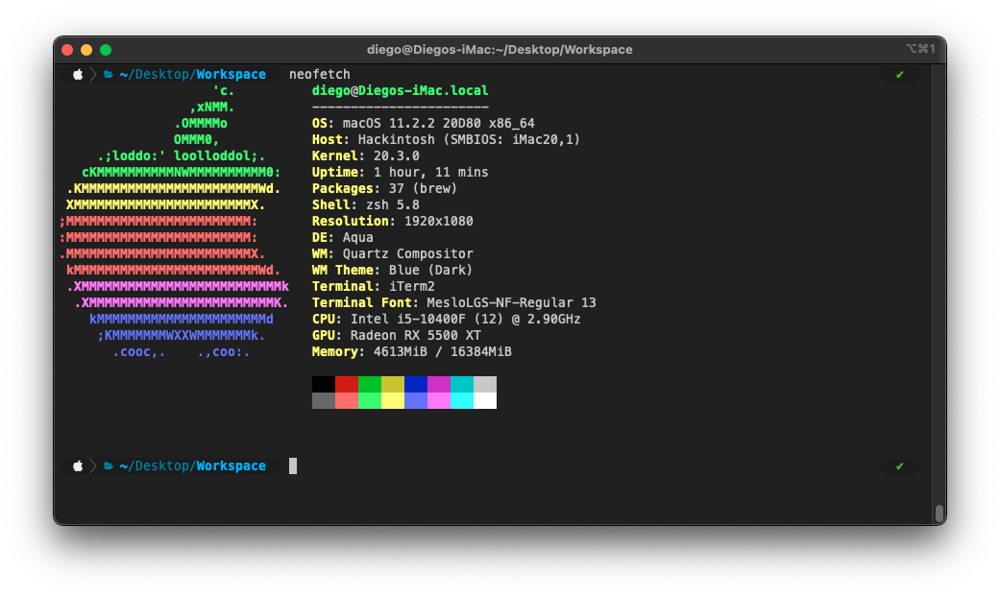
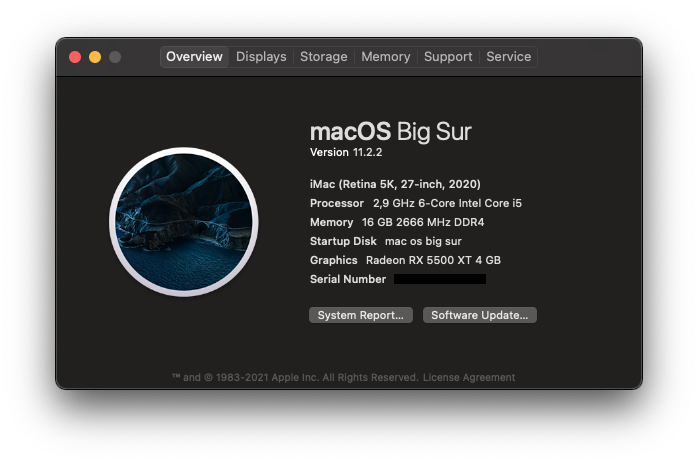

<h3 align="center">i5 10400f RX 5500 XT OpenCore 0.6.6 Big Sur</h3>

  Successful hackintosh, build with OpenCore and Big Sur
  
  

## 📝 Table of Contents

- [My Spec](#spec)
- [Build Info]($opencore)
- [What's working]($working)
- [What's not working]($notworking)
- [No testing (maybe in future)]($notesting)
- [Comments]($comments)

## Spec 

- Processor: Intel Core i5 10400f
- Motherboard: Gigabyte B460M-DS3H (Bios F3)
- Ram: 2x8gb HyperX Fury 2666MHZ DDR4
- Ssd: Crucial BX500 480GB
- Power supply: EVGA 500W
- Video card: Asrock RX 5500 xt 4gb

## Build Info 

- Open Core version: 0.6.6
- SMBIOS: iMac20,1
- OS: macOS 11.2.2 20D80 x86_64

## What's working 

- Sleep / Wake
- Hardware Acceleration
- USB 3.0 without fix, i have a USB hub switch for switching all my peripheral and work perfect, link to this <a href="https://www.amazon.com/-/es/adaptador-perif%C3%A9rico-computadoras-impresora-interruptor/dp/B01N6GD9JO">Ugreen usb 3 switch</a>
- Audio Interface through hub usb recognized native (M Audio 192-4)

## What's not working 

- Gpu sensors

## No testing (maybe in future) 

- iServices
- Booting another OS
- Airdrop, i dont have any other apple device.
- Don't have wireless connection

## Comments 

- if u gonna use this config remember add platform info.
